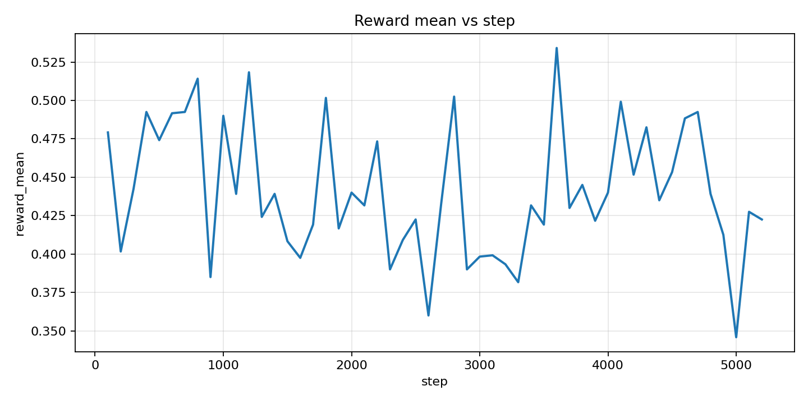
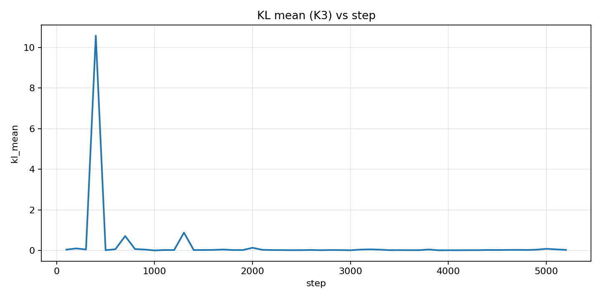
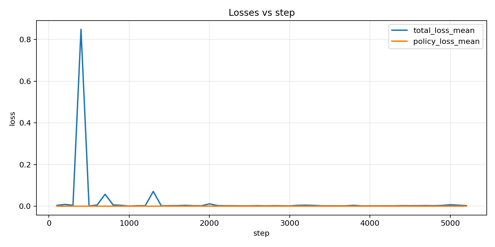
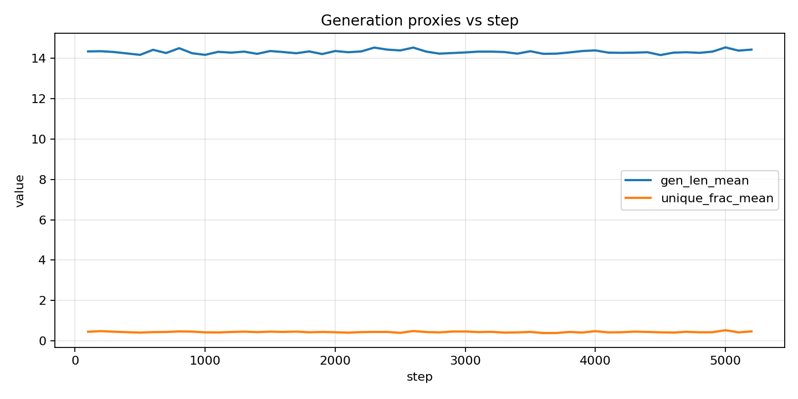
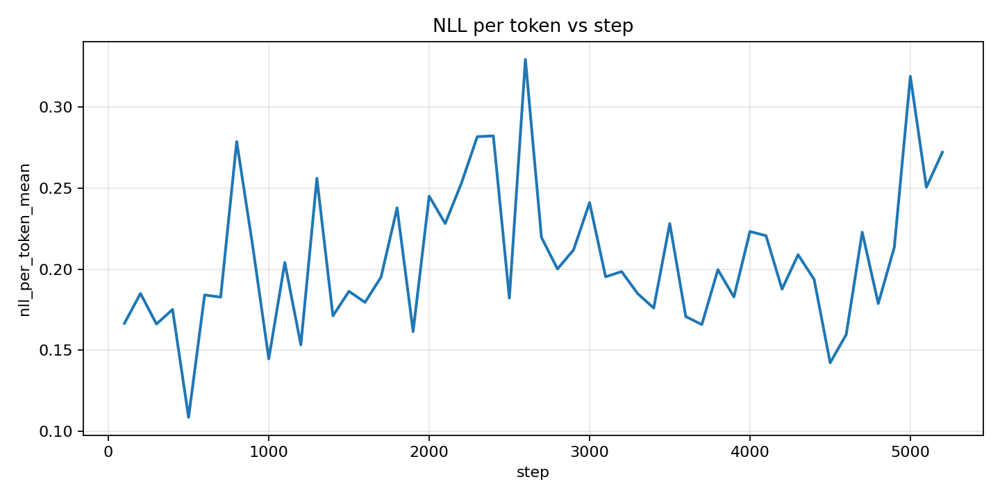

# Analyse GRPO — `run_20260423_141545`

Source principale des métriques: `grpo_metrics.tsv` (52 lignes, steps 100 → 5200).

## Hyperparamètres (config du run)

Extraits de `run_config.json`:

- **Modèle**: `Qwen/Qwen2-VL-2B-Instruct`
- **Dataset**: `local_subset_jsonl` (local: `/mnt/data/vqav2_15k`, `smoke_n=15000`)
- **Génération (rollout)**:
  - `group_size=4`
  - `max_new_tokens=16`
  - `temperature=0.8`
  - `top_p=0.9`
  - `instruction`: `ONE WORD WITHOUT BALISE, NO <answer> OR <thinking>`
- **Optimisation**:
  - `learning_rate=1e-4` (AdamW)
  - `gradient_accumulation_steps=8`
  - `max_grad_norm=1.0`
- **GRPO**:
  - `beta_kl=0.08`
- **Checkpointing / logs**:
  - `save_every=500`
  - `log_every=2`
  - `log_table_every=100` → une ligne TSV toutes les 100 itérations

Extraits de `train_GRPO2_local.py` (structure / choix “fixes”):

- **LoRA (policy entraînée)**:
  - `r=16`, `lora_alpha=32`, `lora_dropout=0.05`
  - `target_modules=["q_proj","k_proj","v_proj","o_proj","gate_proj","up_proj","down_proj"]`
- **Référence**: policy SFT mergée comme “ref” via `model.disable_adapter()` pendant le calcul de KL (K3).
- **Avantages**: normalisation de groupe (moyenne/écart-type sur `group_size`) avec epsilon (implémentation maison `group_advantages`).

## Courbes

### Reward

### KL (K3)

### Pertes

### Proxies de génération

### NLL / token (proxy de “confidence”)

## Observations (à partir du TSV)

- **Reward**: fluctue autour de ~0.40–0.50, sans tendance monotone évidente sur la durée.
  - max observé: **0.534** @ step **3600**
  - min observé: **0.346** @ step **5000**
- **KL**: globalement faible (souvent \(< 0.1\)), mais avec **un gros pic**:
  - **kl_mean max = 10.58 @ step 400**, avec `kl_std` très élevé dans la même ligne (instabilité/évènement “rare” sur cette fenêtre).
  - on voit aussi d’autres “bosses” plus modestes (ex: autour de step 1300 avec `kl_mean` ~0.88).
- **Loss**: le **plus gros total_loss** est au même endroit que le pic de KL (**step 400**, `total_loss_mean=0.849`), ce qui est cohérent avec une pénalité KL qui domine ponctuellement.
- **Génération**:
  - `gen_len_mean` reste proche de ~14 tokens (plafond `max_new_tokens=16`) → le modèle utilise presque tout le budget.
  - `unique_frac_mean` ~0.40–0.50 la plupart du temps → diversité correcte mais pas énorme (avec `group_size=4`, c’est une métrique assez grossière).
- **NLL/token**: varie sensiblement; maximum observé **0.329 @ step 2600** (à croiser avec reward/KL au même endroit).

## Remarques sur les choix d’hyperparamètres (et pistes)

- **Stabilité KL**: le pic à step 400 suggère soit un batch “pathologique”, soit un problème de variance/masquage sur la fenêtre de logging.
  - à tester: augmenter `beta_kl` (ex: 0.08 → 0.12/0.2) *ou* réduire `temperature` (0.8 → 0.6–0.7) pour limiter les déviations.
  - utile: logguer aussi des quantiles de KL (p50/p90/p99) ou `max` sur la fenêtre pour confirmer que c’est un outlier.
- **Qualité reward**: pas de gain clair → soit le signal reward est trop bruité (VQA accuracy binaire/ponctuelle), soit le budget d’updates est trop faible (ici `opt_step` progresse lentement via `grad_accum=8`).
  - à tester: augmenter `group_size` (4 → 8) pour améliorer l’estimation d’avantage (au coût GPU), ou augmenter la durée (smoke_n) si c’est un run “court”.
- **Génération proche du plafond**: si l’objectif “ONE WORD” est strict, on pourrait renforcer ce biais:
  - baisser `max_new_tokens` (16 → 4/6) et/ou ajouter une reward/penalty sur la longueur.

